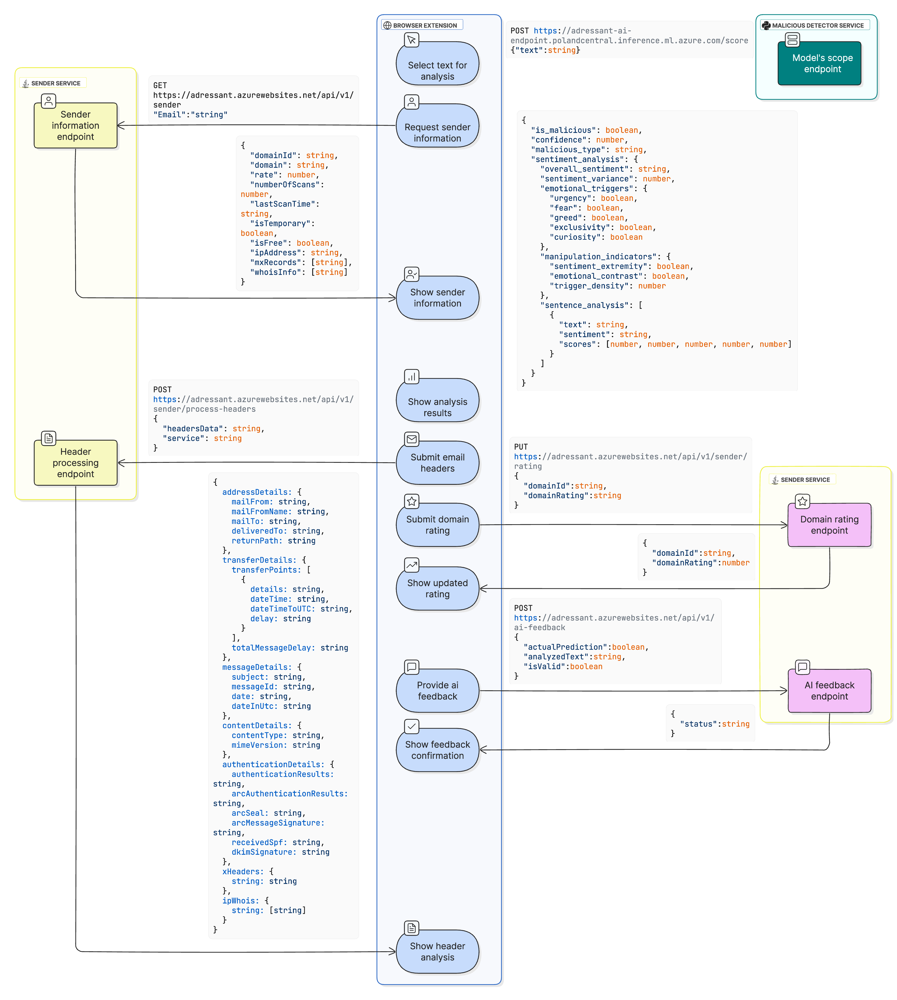
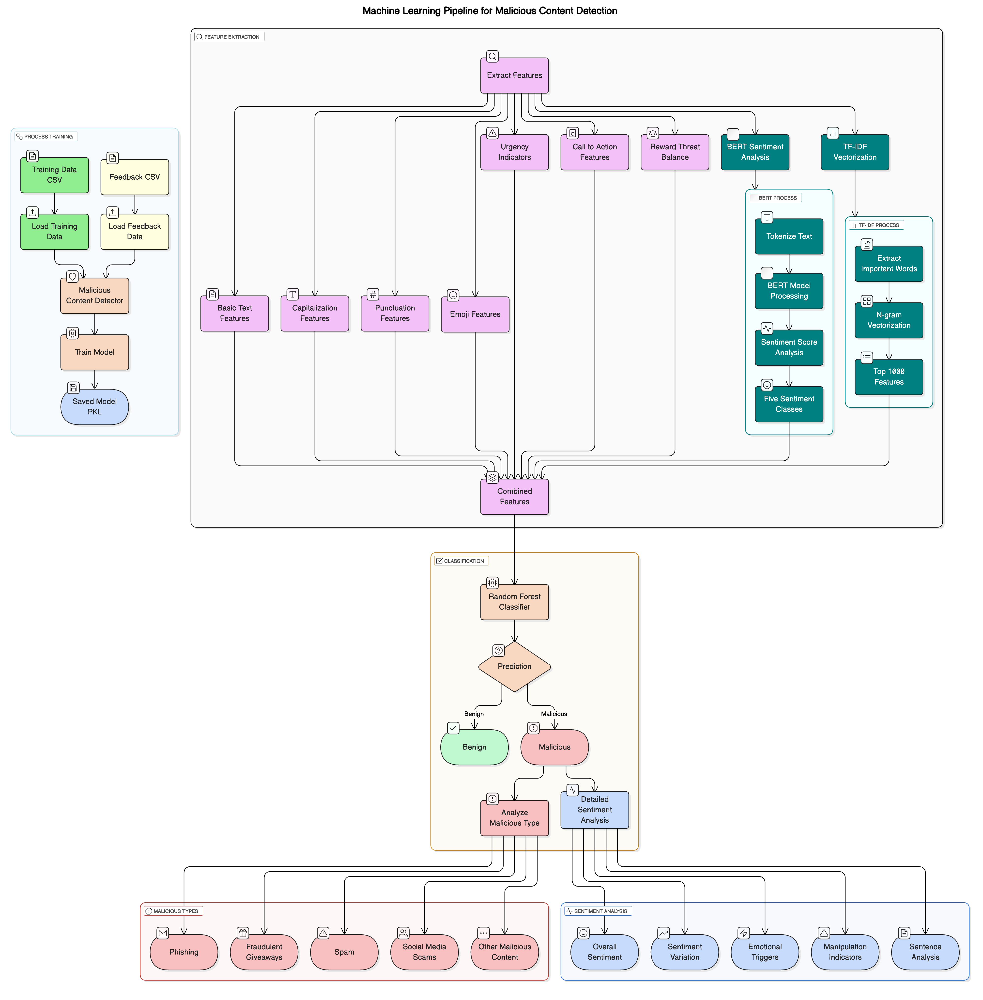

# Adressant 2.0: Multi-Vector Threat Detection System

**Adressant 2.0** is an integrated cybersecurity solution designed to detect malicious and manipulative content in digital communications. It combines technical metadata analysis with AI-driven sentiment analysis to provide a multi-layered defense against phishing, scams, and social engineering.

## 🏗 System Architecture

The project is built on a modular microservice architecture consisting of three main components:

### 1. Browser Extension (Frontend)

A cross-browser tool (Chrome/Edge) that serves as the user interface.

* **Email Security**: Analyzes sender domains and message headers directly within Gmail and Outlook interfaces.
* **Content Detection**: Allows users to highlight any text on a webpage for instant sentiment and threat analysis.
* **Localized UI**: Full support for both English and Ukrainian languages.

### 2. Sender Service (Java Backend)

A high-performance service built with **Spring Boot** and **MS SQL Server**.

* **Header Analysis**: Performs a deep dive into email headers to track message paths and authentication results (SPF, DKIM, DMARC).
* **Domain Evaluation**: Checks domain reputation, age, MX records, and WHOIS information.
* **Feedback API**: Collects user feedback to improve the underlying AI detection models.

### 3. MaliciousContentDetector (Python AI Engine)

The heart of the system's semantic intelligence, deployed on **Microsoft Azure**.

* **Hybrid Model**: Combines Lexical features, TF-IDF vectorization, and Random Forest classification with **BERT** deep learning.
* **Sentiment Intelligence**: Categorizes text into 5 emotional classes and identifies manipulation indicators (urgency, fear, greed).
* **High Performance**: Achieves a **0.974 F1-Score** with an average response time of ~256ms.

### AI Model Data Flow

## 🛠 Technology Stack
* **Languages**: Java 17+, Python 3.10+, JavaScript.
* **Frameworks**: Spring Boot, Flask (for AI API).
* **ML Libraries**: Scikit-learn, Transformers (BERT), SpaCy, Pandas.
* **Monitoring**: Integrated with **Elastic Security** (ELK Stack) for real-time incident alerting.

## 📊 Performance Summary

| Method | Precision | Recall | F1-Score | Accuracy |
| --- | --- | --- | --- | --- |
| **Hybrid (Adressant 2.0)** | **1.000** | **0.950** | **0.974** | **0.962** |
| Random Forest (TF-IDF) | 0.949 | 0.974 | 0.961 | 0.943 |
| BERT Only | 0.781 | 0.802 | 0.791 | 0.707 |

(Based on comparative analysis during system testing )

## 📩 Contact & Collaboration
* **LinkedIn**: [linkedin.com/in/dmytro-shedin](https://www.linkedin.com/in/dmytro-shedin)
* **Email**: [shedindmytro@gmail.com](mailto:shedindmytro@gmail.com)

---
This project was developed and defended as a **Master's Diploma Work** at Kharkiv National University of Radio Electronics (NURE).
